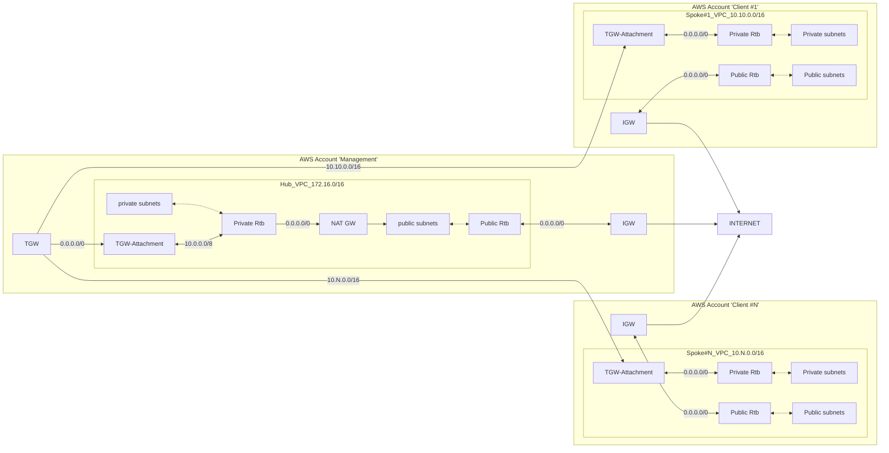

# Install an OCP cluster on AWS with Transit Gateway

!!! warning "Experimental steps"
    The steps described on this page are experimental, as usual on my lab's website! =]

!!! info "CloudFormation templates"
    The CloudFormation templates mentioned on this page are available in the path:
    [mtulio.labs/labs/labs/ocp-install-iac/aws-cloudformation-templates](https://github.com/mtulio/mtulio.labs/tree/master/labs/ocp-install-iac/aws-cloudformation-templates)

Create a Hub-Spoke deployment to use a centralized egress gateway to
deploy OpenShift cluster.

Overview of the network diagram:



### Prerequisites

- Export the variables for your environment:

```sh
RESOURCE_NAME_PREFIX="lab-ci"
AWS_REGION=us-east-1

HUB_VPC_CIDR="172.16.0.0/16"
SPOKE_CIDR_EGRESS="10.0.0.0/8"
```

## Create the Transit Gateway

Create the Transit Gateway in the "Management" account.

Steps:
- Create the Transit Gateway
- Gather the Transit Gateway Route table

Deploy:

- Create Transit Gateway
```sh
aws cloudformation create-stack \
    --region ${AWS_REGION} \
    --stack-name ${RESOURCE_NAME_PREFIX}-tgw \
    --template-body file://./01_vpc_01_transit_gateway.yaml \
    --parameters \
        ParameterKey=NamePrefix,ParameterValue=${RESOURCE_NAME_PREFIX}
```

- Wait for creation to complete:

```sh
aws cloudformation wait stack-create-complete \
    --region ${AWS_REGION} \
    --stack-name ${RESOURCE_NAME_PREFIX}-tgw
```

- Export the Transit Gateway ID and it's Default route table:

```sh
export TGW_ID=$(aws cloudformation describe-stacks \
  --region ${AWS_REGION} --stack-name ${RESOURCE_NAME_PREFIX}-tgw \
  --query 'Stacks[0].Outputs[?OutputKey==`TransitGatewayId`].OutputValue' \
  --output text)

export TGW_RTB=$(aws ec2 describe-transit-gateway-route-tables \
    --filters Name=transit-gateway-id,Values=$TGW_ID \
    --query 'TransitGatewayRouteTables[].TransitGatewayRouteTableId' \
    --output text)
```

## Create Transit (Hub) VPC

Create the "Hub VPC" in the "Management" account.

Overview of steps:

- Create regular VPC (172.254.0.0/16)
- Create a private and public subnet across zones
- Create IGW
- Create a single Nat GW
- Create public route table -> IGW
- Create private route table -> NGW

- Create a Transit Gateway attachment
- Create TGW default route to TG attachment in TG RTB
- Create route entry to 10.0.0.0/8 to Attachment in both public and private route tables for the VPC

- Deploy mirror registry into hub VPC in the public subnet
- Create DNS

### Prerequisites

- Transit Gateway and ID noted as described in the section "Create the Transit Gateway"

- Sync the CloudFormation templates to a Public S3 bucket to be used by CloudFormation nested stack deployment:

> There are two valid flags to reference CloudFormation templates: --template-body or --template-url (only S3 URL is allowed)

```sh
BUCKET_NAME="installer-upi-templates"
TEMPLATE_BASE_URL="https://${BUCKET_NAME}.s3.amazonaws.com"

aws s3api create-bucket --bucket $BUCKET_NAME --region us-east-1
aws s3api put-public-access-block \
    --bucket ${BUCKET_NAME} \
    --public-access-block-configuration \
    BlockPublicAcls=false,IgnorePublicAcls=false,BlockPublicPolicy=false,RestrictPublicBuckets=false
aws s3api put-bucket-policy \
    --bucket ${BUCKET_NAME} \
    --policy "{\"Version\": \"2012-10-17\",
  \"Statement\": [
    {
      \"Effect\": \"Allow\",
      \"Principal\": \"*\",
      \"Action\": \"s3:GetObject\",
      \"Resource\": \"arn:aws:s3:::${BUCKET_NAME}/*\"
    }
  ]
}"

function update_templates() {
    for TEMPLATE in $(ls *.yaml); do
        if [[ ! "${TEMPLATE}" =~ "01_"* ]]; then
            echo "Ignoring ${TEMPLATE}"
            continue
        fi
        aws s3 cp $TEMPLATE s3://$BUCKET_NAME/${TEMPLATE}
    done
}
update_templates
```

### Steps

Create the Hub VPC (transit) using CloudFormation nested stacks deployment:

> https://docs.aws.amazon.com/AWSCloudFormation/latest/UserGuide/quickref-cloudformation.html#w9ab1c23c21c23b5
> TODO --tags

```sh
export HUB_VPC_STACK_NAME="transit-network-hub"
aws cloudformation create-change-set \
--stack-name "${HUB_VPC_STACK_NAME}" \
--change-set-name "${HUB_VPC_STACK_NAME}" \
--change-set-type "CREATE" \
--template-body file://./stack_vpc_transit_hub.yaml \
--include-nested-stacks \
--parameters \
    ParameterKey=NamePrefix,ParameterValue=${RESOURCE_NAME_PREFIX} \
    ParameterKey=PrivateEgressTransitGatewayID,ParameterValue=${TGW_ID} \
    ParameterKey=VpcCidr,ParameterValue=${HUB_VPC_CIDR} \
    ParameterKey=AllowedEgressCidr,ParameterValue=${SPOKE_CIDR_EGRESS} \
    ParameterKey=TemplatesBaseURL,ParameterValue="${TEMPLATE_BASE_URL}"
```

Review the changes in AWS Console or CLI:

```sh
aws cloudformation describe-change-set \
--stack-name "${HUB_VPC_STACK_NAME}" \
--change-set-name "${HUB_VPC_STACK_NAME}"
```

The following values must be satisfied to proceed, otherwise check the events:

```sh
    "ExecutionStatus": "AVAILABLE",
    "Status": "CREATE_COMPLETE",
```

Execute the deployment:

```sh
aws cloudformation execute-change-set \
    --change-set-name "${HUB_VPC_STACK_NAME}" \
    --stack-name "${HUB_VPC_STACK_NAME}"
```

- Wait for the nested stack to complete:

```sh
aws cloudformation wait stack-create-complete \
    --region ${AWS_REGION} \
    --stack-name "${HUB_VPC_STACK_NAME}"
```

- Create a static route for default route entry in TGW Rtb:

> TODO: TGW module does not provide RTB ID, create the custom resource.

```sh
TGW_ATT_HUB=$(aws cloudformation describe-stacks \
    --stack-name "transit-network-hub" \
    --query 'Stacks[].Outputs[?OutputKey==`TransitGatewayAttachmentId`][].OutputValue' \
    --output text)

aws ec2 create-transit-gateway-route \
    --destination-cidr-block "0.0.0.0/0" \
    --transit-gateway-route-table-id "${TGW_RTB}" \
    --transit-gateway-attachment-id "${TGW_ATT_HUB}"
```

### Delete stack (optional)

```sh
aws cloudformation delete-stack --stack-name "transit-network-hub"
```

## Create Cluster #1 with BYO VPC

Install OpenShift cluster in existing VPC (spoke VPC) on AWS using Transit Gateway as
egress gateway for private subnets (spoke VPC).

The CloudFormation templates have been split to provision resources individually,
allowing creating single nested templates to deliver a solution.

The steps described in this section create a nested stack to provision
an AWS VPC and requirements components to deploy OpenShift, using
the Transit Gateway ID to attach to the new VPC, using it as an egress
traffic/default route entry in the private subnets, replacing the per
VPC Nat Gateway resource.

The OpenShift cluster deployment will follow the default flow of installing
a cluster in the existing network (BYO VPC) supplying the subnet IDs in the option
`platform.aws.subnets`.

### Prerequisites

- Transit Gateway and ID noted as described in the section "Create the Transit Gateway"
- Transit VPC, or HUB VPC, created as described in the section "Create Transit (Hub) VPC"

### Steps

Overview:

- Create regular VPC  (10.0.0.0/16)
- Create private and public subnets across zones
- Create IGW
- Create a Transit Gateway attachment
- Create public route table -> IGW
- Create private subnets -> TGW Attch

Deploy:

- Export variables:

```sh
CLUSTER_NAME=c1
CLUSTER_VPC_CIDR=10.10.0.0/16
```

- Create network stacks to install OpenShift with BYO VPC on AWS:

```sh
CLUSTER1_STACK_NAME="cluster-${CLUSTER_NAME}"

aws cloudformation create-change-set \
--stack-name "${CLUSTER1_STACK_NAME}" \
--change-set-name "${CLUSTER1_STACK_NAME}" \
--change-set-type "CREATE" \
--template-body file://./stack_vpc_transit_spoke.yaml \
--include-nested-stacks \
--parameters \
    ParameterKey=NamePrefix,ParameterValue=${CLUSTER_NAME} \
    ParameterKey=PrivateEgressTransitGatewayID,ParameterValue=${TGW_ID} \
    ParameterKey=VpcCidr,ParameterValue=${CLUSTER_VPC_CIDR} \
    ParameterKey=TemplatesBaseURL,ParameterValue="${TEMPLATE_BASE_URL}"
```

- Execute the nested stacks/change set:

```sh
aws cloudformation execute-change-set \
    --change-set-name "${CLUSTER1_STACK_NAME}" \
    --stack-name "${CLUSTER1_STACK_NAME}"
```

- Extract and merge the subnet IDs:

```sh
mapfile -t SUBNETS < <(aws  cloudformation describe-stacks \
    --stack-name "${CLUSTER1_STACK_NAME}" \
    --query 'Stacks[0].Outputs[?OutputKey==`PrivateSubnetIds`].OutputValue' \
    --output text | tr ',' '\n')

mapfile -t -O "${#SUBNETS[@]}" SUBNETS < <(aws  cloudformation describe-stacks \
    --stack-name "${CLUSTER1_STACK_NAME}" \
    --query 'Stacks[0].Outputs[?OutputKey==`PublicSubnetIds`].OutputValue' \
    --output text | tr ',' '\n')

echo ${SUBNETS[*]}
```

- Create install-config.yaml:

```sh
export PULL_SECRET_FILE=/path/to/pull-secret
export SSH_PUB_KEY_FILE=${HOME}/.ssh/id_rsa.pub
export BASE_DOMAIN=devcluster.openshift.com
INSTALL_DIR="${HOME}/openshift-labs/${CLUSTER_NAME}"
mkdir $INSTALL_DIR

cat <<EOF > ${INSTALL_DIR}/install-config.yaml
apiVersion: v1
publish: External
baseDomain: ${BASE_DOMAIN}
metadata:
  name: "${CLUSTER_NAME}"
networking:
  machineNetwork:
  - cidr: ${CLUSTER_VPC_CIDR}
platform:
  aws:
    region: ${AWS_REGION}
    subnets:
$(for SB in ${SUBNETS[*]}; do echo "    - $SB"; done)

pullSecret: '$(cat ${PULL_SECRET_FILE} | awk -v ORS= -v OFS= '{$1=$1}1')'
sshKey: |
  $(cat ${SSH_PUB_KEY_FILE})
EOF
```

- Create cluster

```sh
openshift-install create cluster --dir ${INSTALL_DIR} --log-level=debug
```

- Review installation

```sh
export KUBECONFIG=${INSTALL_DIR}/auth/kubeconfig
oc get nodes
```

```text
$ oc get clusterversion
NAME      VERSION       AVAILABLE   PROGRESSING   SINCE   STATUS
version   4.15.0-rc.0   True        False         2m30s   Cluster version is 4.15.0-rc.0
```

### Destroy (optional)

- Destroy cluster

```sh
openshift-install destroy cluster --dir ${INSTALL_DIR} --log-level=debug
```

- Network

```sh
aws cloudformation delete-stack \
    --stack-name "cluster-${CLUSTER_NAME}"
```

## Create Cluster #2 with full IPI

Install OpenShift cluster on AWS using Transit Gateway as
egress gateway for private subnets (spoke VPC).

The steps described in this section create an OpenShift cluster,
forcing to create a Transit Gateway Attachment linked to the VPC
when the install-config option `platform.aws.privateEgressTransitGatewayId`
is set with the Transit Gateway ID created in the section "".
The installer skips the Nat Gateway creation, adding the default
route entry for private route tables/subnets the Transit Gateway
Attachment ID.

### Prerequisites

- Transit Gateway and ID noted as described in the section "Create the Transit Gateway"
- Transit VPC, or HUB VPC, created as described in the section "Create Transit (Hub) VPC"

### Steps

Overview:

- Create regular VPC  (10.1.0.0/16)
- Create private and public subnets across zones
- Create IGW
- Create a Transit Gateway attachment
- Create public route table -> IGW
- Create private subnets -> TGW Attach

Deploy:

- Export variables:

```sh
CLUSTER2_NAME=c13
CLUSTER2_VPC_CIDR=10.11.0.0/16
```

- Create install-config.yaml setting the option `platform.aws.privateEgressTransitGatewayId`:

```sh
export PULL_SECRET_FILE=/path/to/pull-secret
export CLUSTER_NAME=$CLUSTER2_NAME
export CLUSTER_VPC_CIDR=$CLUSTER2_VPC_CIDR
export SSH_PUB_KEY_FILE=${HOME}/.ssh/id_rsa.pub
export BASE_DOMAIN=devcluster.openshift.com

INSTALL_DIR="${HOME}/openshift-labs/${CLUSTER_NAME}"
mkdir $INSTALL_DIR

cat <<EOF > ${INSTALL_DIR}/install-config.yaml
apiVersion: v1
publish: External
baseDomain: ${BASE_DOMAIN}
metadata:
  name: "${CLUSTER_NAME}"
networking:
  machineNetwork:
  - cidr: ${CLUSTER_VPC_CIDR}
platform:
  aws:
    region: ${AWS_REGION}
    privateEgressTransitGatewayId: ${TGW_ID}

pullSecret: '$(cat ${PULL_SECRET_FILE} | awk -v ORS= -v OFS= '{$1=$1}1')'
sshKey: |
  $(cat ${SSH_PUB_KEY_FILE})
EOF
```

- Create cluster

```sh
OPENSHIFT_INSTALL_RELEASE_IMAGE_OVERRIDE="quay.io/openshift-release-dev/ocp-release:4.15.0-rc.0-x86_64" \
openshift-install-devel create cluster --dir ${INSTALL_DIR} --log-level=debug
```

### Destroy cluster

```sh
openshift-install-devel destroy cluster --dir ${INSTALL_DIR} --log-level=debug
```

## Costs

> TBD

## References

- https://docs.aws.amazon.com/vpc/latest/tgw/transit-gateway-nat-igw.html
- https://aws.amazon.com/blogs/networking-and-content-delivery/using-nat-gateways-with-multiple-amazon-vpcs-at-scale/

- Stack Set nested cloudformation template: https://curiousorbit.com/blog/aws-cloudformation-nested-stacks/
- https://github.com/openshift/installer/compare/master...mtulio:installer:exp-aws-hub-spoke-transit?expand=1