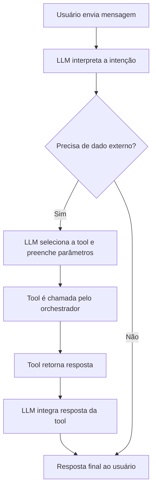

# MCP File Reader Server

A simple HTTP server that can read and summarize local files.

## Features

- List all files in the `./files` directory
- Read file contents
- Generate file summaries (word count, line count, preview)

## API Endpoints

- `GET /files` - List all files
- `GET /files/{filename}` - Get file contents
- `GET /summary/{filename}` - Get file summary

## Getting Started

1. Create a `files` directory in the project root (it will be created automatically on first run)
2. Place files you want to read in the `files` directory
3. Run the server:
   ```bash
   go run main.go
   ```
4. The server will start on port 8080

## Example Usage

1. List all files:
   ```bash
   curl http://localhost:8080/files
   ```

2. Read a file:
   ```bash
   curl http://localhost:8080/files/example.txt
   ```

3. Get file summary:
   ```bash
   curl http://localhost:8080/summary/example.txt
   ```

## Project Structure

- `main.go` - Main server implementation
- `files/` - Directory for storing files to be read 


## Fluxo de uso no MCP

