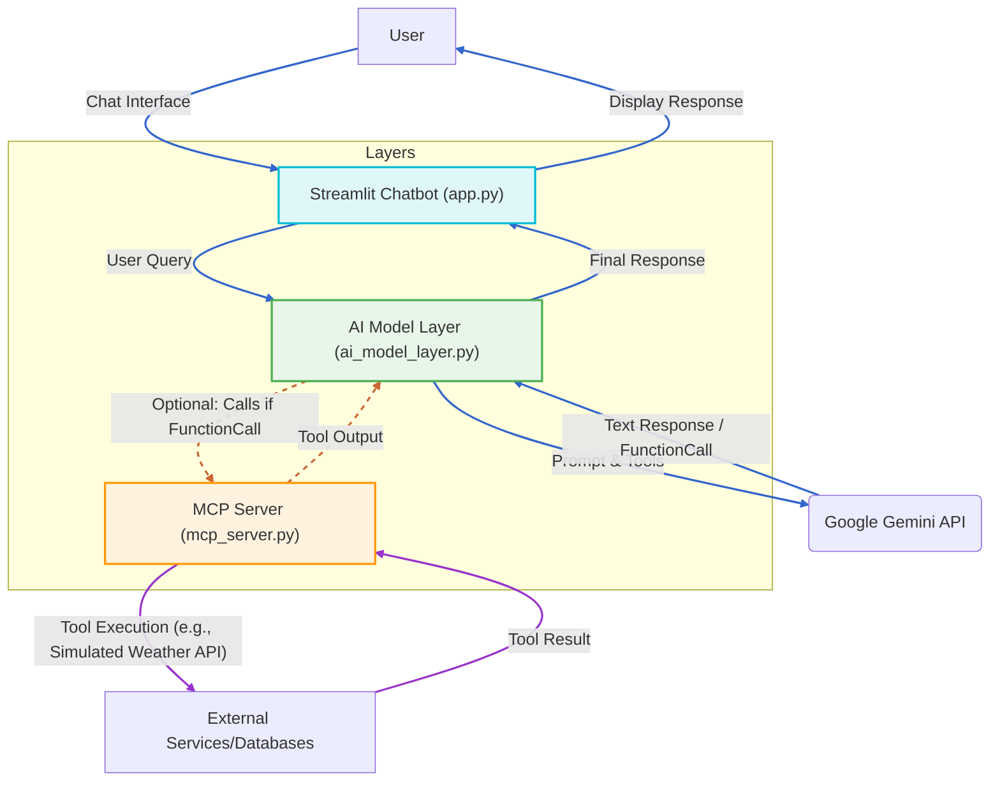
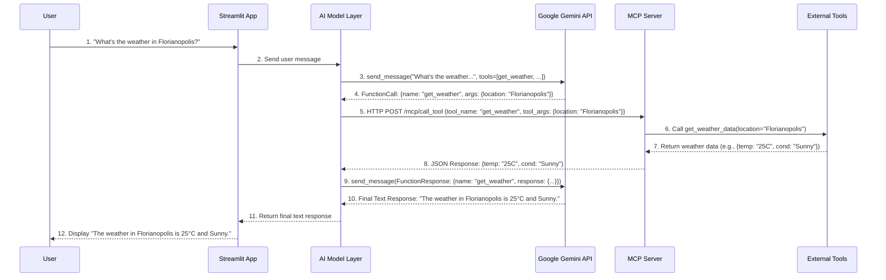

# Gemini AI Chatbot with MCP (Model Context Protocol) Integration

This project demonstrates a sophisticated AI chatbot built with Streamlit, powered by Google's Gemini API, and integrated with a simulated Model Context Protocol (MCP) server for tool execution. This architecture showcases how an AI model can reason, identify the need for external tools, and securely leverage them to fulfill user requests.

Table of Contents:

- Features
- Architecture Diagram
- Data Flow Diagram
- Prerequisites
- Setup Instructions
    - 1. Clone the Repository
    - 2. Create and Activate Virtual Environment
    - 3. Install Dependencies
    - 4. Configure Gemini API Key
- How to Run
- How to Use
- Project Structure
- Extending the Project
- Collaboration
- License

## Features

- Interactive Chatbot: A user-friendly interface built with Streamlit.
- Gemini API Integration: Leverages Gemini's advanced reasoning and natural language understanding.
- Function Calling: Demonstrates Gemini's ability to identify when a specific tool is needed to answer a query.
- Simulated MCP Server: A lightweight Flask server acting as an MCP endpoint, managing external tool execution.
- Two Example Tools:
    - get_weather: Fetches simulated weather data for a given location.
    - generate_random_hello_world: Provides various "hello world" greetings.
- Clear Separation of Concerns: Distinct layers for the UI, AI model logic, and tool execution.

## Architecture Diagram

This diagram illustrates the high-level components and their relationships.



Explanation:

- Streamlit Chatbot (app.py): The user-facing application providing the chat interface.
- AI Model Layer (ai_model_layer.py): The brain of the application. It orchestrates communication with Gemini and acts as a router for tool calls.
- Google Gemini API: The large language model (LLM) that performs reasoning, understands prompts, and decides if a tool is needed.
- MCP Server (mcp_server.py): A separate service that registers and executes "tools." It encapsulates the logic for interacting with external systems.
- External Services/Databases: Real-world APIs, databases, or other services that the MCP server's tools interact with (simulated here).


## Data Flow Diagram

This diagram details the sequence of interactions when a user's query requires a tool call.




## Prerequisites

Before running this application, ensure you have the following installed:

- Python 3.8+
- Google Gemini API Key: You can generate one from Google AI Studio.

## Setup Instructions

1. Clone the Repository

```sh
git clone https://github.com/mtulio/gemini-mcp-chatbot.git
cd gemini-mcp-chatbot
```

(Replace your-username/gemini-mcp-chatbot.git with your actual repository URL if you fork it)

2. Create and Activate Virtual Environment

It's highly recommended to use a virtual environment to manage dependencies.

For Linux/macOS:

```Bash

python3 -m venv venv
source venv/bin/activate
```

For Windows:

```Bash
python -m venv venv
.\venv\Scripts\activate
```

3. Install Dependencies

Install all required Python packages using pip:

```Bash
pip install -r requirements.txt
```

4. Configure Gemini API Key

Create a `.env` file in the root of the project directory (gemini_mcp_app/) and add your Gemini API key:

```Bash
GEMINI_API_KEY="YOUR_GEMINI_API_KEY_HERE"
```

Important: Never commit your .env file or API keys to version control (e.g., Git)!

## How to Run

You need to run two separate components: the MCP server and the Streamlit chatbot.

1. Run the MCP Server
Open your first terminal window, navigate to the project root, and run:

```Bash
python mcp_server.py
```

You should see output indicating the server is running on http://127.0.0.1:5000.

2. Run the Streamlit Chatbot

Open a second terminal window, navigate to the project root, and run:

```Bash
streamlit run app.py
```

This will open the Streamlit application in your web browser (usually http://localhost:8501).

## How to Use

Once both the MCP server and the Streamlit app are running:

- Chat with the bot!
- Try general questions: "Tell me a joke."
- Try the weather tool: "What's the weather in Florianopolis?", "How about London?", "Can you tell me the temperature in São Paulo?"
- Try the random hello tool: "Say hello.", "Give me a random greeting."

The AI Model Layer will automatically detect when to use the tools via the MCP server based on your queries.

## Project Structure

```
gemini_mcp_app/
├── app.py                     # Streamlit chatbot frontend
├── ai_model_layer.py          # Implements communication with Gemini and handles tool identification.
├── mcp_server.py              # Hypothetical MCP server with example tools (weather, random greeting).
├── requirements.txt           # Python dependencies.
└── .env                       # Environment variables (e.g., GEMINI_API_KEY).
```


## Extending the Project

- Add More Tools:
    - Define new functions in mcp_server.py.
    - Update the available_tools list in ai_model_layer.py with corresponding Tool (function) declarations.
    - Ensure your tools handle their arguments correctly.
- Real-world Tool Integration: Replace the simulated tool logic in mcp_server.py with actual API calls (e.g., OpenWeatherMap, Google Maps API, a database query).
- Advanced MCP Features: Explore more complex MCP concepts like resource management, eventing, and secure tool execution.
- Error Handling: Implement more robust error handling and user feedback when tool calls fail or the MCP server is unreachable.
- Deployment: Containerize the MCP server (e.g., with Docker) and deploy it to a cloud platform like Google Cloud Run for scalability and reliability. Deploy the Streamlit app to a hosting service.

## Collaboration

Contributions are welcome! If you'd like to improve this project:

1. Fork the repository.
1. Create a new branch (git checkout -b feature/your-feature-name).
1. Make your changes.
1. Commit your changes (git commit -m 'Add new feature').
1. Push to the branch (git push origin feature/your-feature-name).
1. Open a Pull Request.

Please ensure your code adheres to good practices, includes necessary documentation, and passes any tests (if implemented).

## License

This project is open-sourced under the MIT License. See the LICENSE file (if applicable) for more details.
